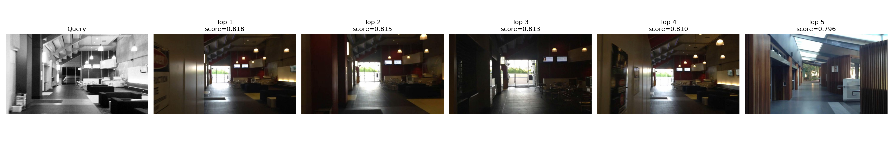
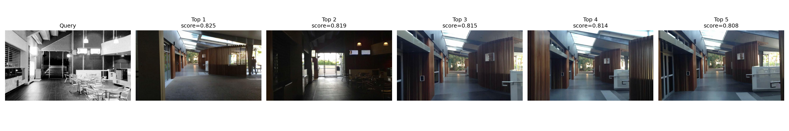
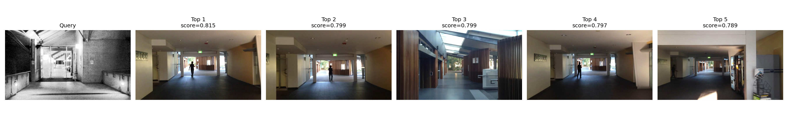

# Visual Place Recognition with CNN Global Descriptors

This mini project implements a simple visual place recognition (VPR) pipeline in
PyTorch. Given a query image, the system retrieves visually similar places from a
database using pretrained CNN features and cosine similarity.

The project is motivated by loop closure and relocalization in SLAM. Traditional
SLAM systems often rely on handcrafted local features and geometric verification,
while learning-based VPR methods learn compact scene-level representations that
can be more robust to viewpoint and appearance changes.

## Overview

The current baseline uses a pretrained ResNet18 as a global image descriptor:

```text
image -> ResNet18 backbone -> 512-D feature -> L2 normalization -> cosine retrieval
```

The final classifier layer of ResNet18 is removed, so the model is used as a
feature extractor rather than an ImageNet classifier. Since the output features
are L2-normalized, dot product between two feature vectors is equivalent to
cosine similarity.

## Project Structure

```text
vpr-loop-closure/
  data/
    gardens_point/
      database/
      query/
  outputs/
    visualizations/
  src/
    dataset.py
    evaluate.py
    extract_features.py
    models.py
    retrieve.py
    train_triplet.py
    triplet_dataset.py
    visualize.py
  README.md
```

## Dataset

This project uses a subset of the
[Gardens Point Walking dataset](https://huggingface.co/datasets/medwa126/GardensPointWalking).
It contains images from the same route captured under different conditions:

- `day_left`: daytime traversal from the left side of the path
- `day_right`: daytime traversal from the right side of the path
- `night_right`: nighttime traversal from the right side of the path

In the current setup:

```text
data/gardens_point/
  database/
    day_left/
      Image000.jpg ... Image099.jpg
  query/
    day_right/
      Image000.jpg ... Image099.jpg
    night_right/
      Image000.jpg ... Image099.jpg
```

The image index is used as a pseudo ground truth location. For example,
`query/day_right/Image023.jpg` is expected to match a nearby database image such
as `database/day_left/Image023.jpg`, allowing a small index tolerance.

## Installation

Create and activate a conda environment:

```bash
conda create -n vpr-loop-closure python=3.11
conda activate vpr-loop-closure
```

Install PyTorch with CUDA support, then install the remaining dependencies:

```bash
pip install torch torchvision --index-url https://download.pytorch.org/whl/cu128
pip install numpy pillow matplotlib tqdm scikit-learn
```

Verify CUDA:

```bash
python - <<'PY'
import torch

print(torch.__version__)
print(torch.version.cuda)
print(torch.cuda.is_available())
print(torch.cuda.get_device_name(0) if torch.cuda.is_available() else "CPU only")
PY
```

## Usage

### 1. Extract Database Features

```bash
python -m src.extract_features \
  --image-dir data/gardens_point/database \
  --output outputs/gardens_database_features.pt
```

### 2. Extract Query Features

```bash
python -m src.extract_features \
  --image-dir data/gardens_point/query \
  --output outputs/gardens_query_features.pt
```

Each `.pt` file stores:

```python
{
    "features": Tensor[N, 512],
    "paths": list[str],
}
```

To extract features with a triplet fine-tuned checkpoint, pass `--checkpoint`:

```bash
python -m src.extract_features \
  --image-dir data/gardens_point/query \
  --output outputs/gardens_query_features_triplet.pt \
  --checkpoint outputs/checkpoints/resnet18_triplet.pt
```

### 3. Retrieve Top-K Matches

```bash
python -m src.retrieve \
  --database outputs/gardens_database_features.pt \
  --query outputs/gardens_query_features.pt \
  --top-k 5
```

### 4. Evaluate Retrieval

```bash
python -m src.evaluate \
  --database outputs/gardens_database_features.pt \
  --query outputs/gardens_query_features.pt \
  --top-k 10 \
  --tolerance 3
```

The tolerance means that a match is treated as correct if the database image
index is within `±3` frames of the query image index.

To evaluate a held-out segment, use `--split-name`, `--min-index`, and
`--max-index`:

```bash
python -m src.evaluate \
  --database outputs/gardens_database_features_triplet_split.pt \
  --query outputs/gardens_query_features_triplet_split.pt \
  --top-k 10 \
  --tolerance 3 \
  --split-name night_right \
  --min-index 70 \
  --max-index 99
```

### 5. Visualize Retrieval Results

```bash
python -m src.visualize \
  --database outputs/gardens_database_features.pt \
  --query outputs/gardens_query_features.pt \
  --query-index 123 \
  --top-k 5 \
  --output outputs/visualizations/night_top5_success_123.png
```

### 6. Train with Triplet Loss

The triplet training stage uses nighttime images as anchors, nearby daytime
images as positives, and far-away daytime images as negatives:

```bash
python -m src.train_triplet \
  --anchor-dir data/gardens_point/query/night_right \
  --database-dir data/gardens_point/database/day_left \
  --output outputs/checkpoints/resnet18_triplet_train_000_069.pt \
  --epochs 5 \
  --batch-size 16 \
  --lr 1e-4 \
  --margin 0.2 \
  --min-index 0 \
  --max-index 69
```

## Results

Using 100 database images from `day_left` and 200 query images from `day_right`
and `night_right`, the pretrained ResNet18 baseline obtains:

| Query split | Recall@1 | Recall@5 | Recall@10 | Precision@5 |
| --- | ---: | ---: | ---: | ---: |
| `day_right` | 0.9600 | 1.0000 | 1.0000 | 0.8020 |
| `night_right` | 0.5100 | 0.7400 | 0.8700 | 0.3920 |

These results show that pretrained ResNet18 descriptors handle moderate lateral
viewpoint changes well, but performance drops under stronger day-night
appearance changes.

After triplet-loss fine-tuning on the full `night_right` sequence, retrieval
improves substantially:

| Query split | Recall@1 | Recall@5 | Recall@10 | Precision@5 |
| --- | ---: | ---: | ---: | ---: |
| `day_right` | 0.9900 | 1.0000 | 1.0000 | 0.8800 |
| `night_right` | 0.8600 | 1.0000 | 1.0000 | 0.7820 |

This shows that metric learning can reshape the embedding space so that
day-night images of the same place become closer while distant places are pushed
apart.

For a stricter test, the triplet model was trained only on
`night_right/Image000.jpg` to `Image069.jpg`, then evaluated on the held-out
`Image070.jpg` to `Image099.jpg` segment:

| Evaluation split | Recall@1 | Recall@5 | Recall@10 | Precision@5 |
| --- | ---: | ---: | ---: | ---: |
| `night_right` train `000-069` | 0.9143 | 1.0000 | 1.0000 | 0.8229 |
| `night_right` test `070-099` | 0.5667 | 1.0000 | 1.0000 | 0.4933 |

The gap between train and held-out test performance indicates overfitting in
top-1 ranking, but the perfect held-out Recall@5 suggests that the fine-tuned
descriptor remains useful for loop-closure candidate retrieval.

## Qualitative Examples

### Night Success

`night_success_118.png` shows a nighttime query where the top retrievals are
nearby correct locations. The descriptor captures stable global layout cues such
as corridor direction, doorway position, lighting structure, and indoor geometry.



### Top-1 Failure, Top-5 Success

`night_top5_success_123.png` shows a case where the top-1 result is wrong, but a
correct nearby place appears in the top-5 candidates. This is important for SLAM:
VPR can propose loop-closure candidates, while geometric verification can later
accept or reject them.



### Night Failure

`night_failure_103.png` shows a failure case where the correct place does not
appear in the top-5 results. The pretrained descriptor is confused by strong
illumination changes and visually similar corridor-like structures.



## Discussion

This baseline demonstrates that off-the-shelf CNN global descriptors are already
useful for visual place recognition. However, the performance gap between
`day_right` and `night_right` highlights the difficulty of appearance changes.
Triplet-loss fine-tuning improves day-night retrieval, but the held-out split
shows why train/test separation is necessary when judging generalization.

In a SLAM system, this type of VPR module would typically be used as a candidate
retrieval stage:

```text
query image -> top-k place candidates -> geometric verification -> loop closure
```

High recall is important because the correct place must appear among the
candidates. High precision is also important because false loop closures can
damage the pose graph or map.

## Next Steps

- Add more systematic failure analysis.
- Compare ResNet18 with MobileNetV2, ResNet50, or EfficientNet.
- Add hard negative mining for more challenging place recognition.
- Explore sequence-based matching for smoother retrieval over trajectories.
- Add geometric verification with local features as a SLAM-style post-filter.

## Notes

Large downloaded datasets and generated `.pt` feature files should usually not
be committed to Git. The repository should contain the code, documentation, and a
small number of representative visualization images.
